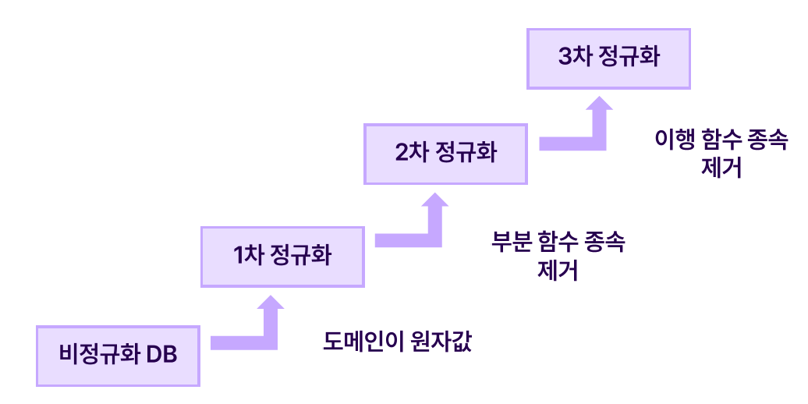
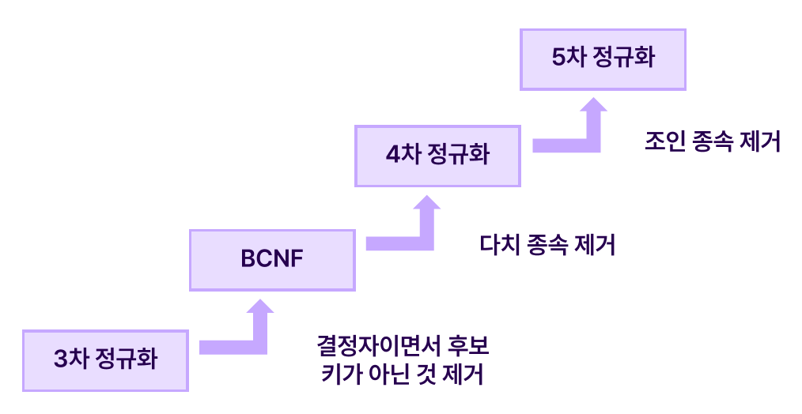

# 데이터 모델링과 정규화

### 목차
1. [데이터 모델링](#✅-1-데이터-모델링)
2. [이상 현상(Anomaly)](#✅-2-이상-현상anomaly)
3. [정규화(Normalization)](#✅-3-정규화normalization)
4. [1차 정규화 (1NF)](#✅-4-1차-정규화-1nf)
5. [2차 정규화 (2NF)](#✅-5-2차-정규화-2nf)
6. [3차 정규화 (3NF)](#✅-6-3차-정규화-3nf)
7. [BCNF(Boyce-Codd 정규형)](#✅-7-bcnfboyce-codd-정규형)

---

# ✅ 1. 데이터 모델링

### 📌 정의
- **현실 세계의 데이터를 데이터베이스 구조로 표현하는 과정**
- 데이터베이스를 설계할 때 꼭 필요한 단계

### 📌 데이터 모델의 구성요소
- **개체(Entity)**: 표현하려는 객체 (ex. 고객, 제품)
- **속성(Attribute)**: 개체의 특성 (ex. 이름, 가격)
- **관계(Relationship)**: 개체 간 연결 (ex. 고객이 주문한다)

### 📌 데이터 모델링 단계
| 단계 | 설명 |
|------|------|
| 개념적 설계 | 현실 세계를 개념적으로 표현 |
| 논리적 설계 | DBMS가 이해 가능한 논리 구조로 설계 |
| 물리적 설계 | 실제 DB에 테이블 구조로 구현 |

---

# ✅ 2. 이상 현상(Anomaly)

### 📌 정의 
> 정규화를 하지 않으면 발생하는 데이터 불일치 문제

### 📌 이상 현상의 종류
| 종류 | 설명 |
|------|------|
| 삽입 이상 | 일부 정보만 추가 불가 |
| 갱신 이상 | 중복된 데이터 일관성 유지 어려움 |
| 삭제 이상 | 한 정보 삭제 시 다른 정보도 손실 |

---

# ✅ 3. 정규화(Normalization)

### 📌 정의
> 이상 현상을 제거하기 위해 테이블을 구조화하는 과정

### 📌 핵심 개념
- **함수 종속성**: 어떤 속성값이 다른 속성값을 결정짓는 관계
- **종속 제거 → 무결성 보장 → 데이터 중복 최소화**

### 📌 정규화 단계 요약
| 정규형 | 요약 설명 |
|--------|-----------|
| **1NF** | 컬럼은 원자값(하나의 값)만 가지도록 |
| **2NF** | 부분 함수 종속 제거 (기본키 전체에 종속되어야 함) |
| **3NF** | 이행 함수 종속 제거 (비주요 속성이 비주요 속성에 종속되면 안 됨) |

---

# ✅ 4. 1차 정규화 (1NF)

### 📌 정의  
> 테이블의 컬럼이 **하나의 값(원자값)**만 가지도록 도메인을 설정하는 정규화 과정

### 📌 개념 설명  
- 하나의 셀에 여러 값을 넣는 것은 좋지 않음  
- 값을 **분리된 행(row)**으로 나누어야 함

### 📌 정규화 전 예시

| 고객 ID | 고객 이름 | 대여 시간 |
|---------|-----------|------------|
| kmax6   | 김민준    | 2020-08-20 13:01:02, 2020-09-01 20:39:52 |

→ 한 셀에 **대여 시간이 2개** 들어가 있음 (다중 값)

### 📌 정규화 후 예시

| 고객 ID | 고객 이름 | 대여 시간           |
|---------|-----------|----------------------|
| kmax6   | 김민준    | 2020-08-20 13:01:02  |
| kmax6   | 김민준    | 2020-09-01 20:39:52  |

→ 행(row)을 분리하여 **하나의 셀 = 하나의 값** 원칙 만족

---

# ✅ 5. 2차 정규화 (2NF)

### 📌 정의  
> **부분 함수 종속**을 제거하여 완전 함수 종속이 되도록 테이블을 분해하는 과정  
※ 전제: **기본키가 복합키**일 때만 해당됨

### 📌 개념 설명  
- 어떤 속성이 **기본키 일부에만 종속**되어 있으면 **부분 함수 종속**  
- 이걸 그대로 두면 데이터 **중복**, **불일치**, **삭제 이상** 발생함

### 📌 정규화 전 예시

| 고객 ID | 고객 이름 | 대여 시간           | 대여 장소       |
|---------|-----------|----------------------|------------------|
| kmax6   | 김민준    | 2020-08-20 13:01:02  | 서울 강남구 역삼동 |
| flykite | 이서연    | 2020-11-11 22:01:30  | 서울 동작구 대방동 |

→ 기본키 = `고객 ID + 대여 시간` (복합키)  
→ 그런데 `고객 이름`은 `고객 ID`로만 결정됨 (부분 함수 종속)

### 📌 정규화 후 예시

#### 👉 고객 테이블

| 고객 ID | 고객 이름 |
|---------|-----------|
| kmax6   | 김민준    |
| flykite | 이서연    |

#### 👉 대여 테이블

| 고객 ID(FK) | 대여 시간           | 대여 장소       |
|-------------|----------------------|------------------|
| kmax6       | 2020-08-20 13:01:02  | 서울 강남구 역삼동 |
| flykite     | 2020-11-11 22:01:30  | 서울 동작구 대방동 |

→ 고객 정보와 대여 정보를 **분리**하여 중복 제거, 무결성 유지

---

# ✅ 6. 3차 정규화 (3NF)

### 📌 정의  
> **이행 함수 종속**(Transitive Dependency)을 제거하여  
> 속성 간의 종속 관계를 명확하게 분리하는 **정규화 과정**

### 📌 핵심 개념
- 이행 함수 종속:  
  X → Y, Y → Z인 관계일 때,  
  X → Z가 성립하는 경우

- 이 경우 Y는 **기본키가 아닌 중간 속성**인데  
  Z를 결정하게 되므로  
  테이블 구조가 비효율적이고 중복이 발생함

### 📌 예시로 이해하기

#### 🔸 BEFORE 정규화 (이행 함수 종속 존재)

| 고객 ID(FK) | 대여 시간 | 대여 장소        | 브랜드명 | 연식 | 분당 가격 | 기본료 | 회사명     |
|-------------|------------|------------------|----------|------|-----------|--------|------------|
| kmax6       | 2020-08-20 | 서울시 강남구 역삼동 | boardkick | 2015 | 100       | 1000   | elice      |
| flykite     | 2020-11-11 | 서울시 동작구 대방동 | willgo    | 2018 | 110       | 950    | everythere |

- 고객 ID + 대여 시간 → 브랜드명  
- 브랜드명 → 회사명

➡ 이 때, **회사명은 고객 ID와 직접 관련이 없음**  
하지만 브랜드명에 따라 결정되는 값이므로  
이행 종속이 발생

### 📌 문제점 (이행 함수 종속으로 인한 이상 현상)
| 유형        | 설명                                                                 |
|-------------|----------------------------------------------------------------------|
| 삽입 이상   | 회사가 브랜드를 하나도 출시하지 않으면 회사 정보를 삽입할 수 없음 |
| 갱신 이상   | 브랜드에 대한 회사가 변경되면, 관련된 모든 튜플에서 갱신해야 함    |
| 삭제 이상   | 고객의 대여 정보를 삭제하면 회사 정보도 함께 사라질 수 있음       |

### 📌 해결 방법: 테이블 분리

#### 🔹 대여 테이블
| 고객 ID(FK) | 대여 시간 | 대여 장소        | 브랜드명(FK) | 연식 | 기본료 |
|-------------|------------|------------------|----------------|------|--------|
| kmax6       | 2020-08-20 | 서울시 강남구 역삼동 | boardkick       | 2015 | 1000   |
| flykite     | 2020-11-11 | 서울시 동작구 대방동 | willgo          | 2018 | 950    |

#### 🔹 가격 테이블
| 브랜드명 | 분당 가격 |
|----------|------------|
| boardkick | 100       |
| willgo    | 110       |

#### 🔹 회사 테이블
| 브랜드명 | 회사명     |
|----------|------------|
| boardkick | elice      |
| willgo    | everythere |

### 📌 3차 정규화의 결과
- **모든 비주요 속성이 기본키에만 종속됨**
- **중복 제거**
- **삽입/갱신/삭제 이상 방지**

---

# ✅ 7. BCNF(Boyce-Codd 정규형)

### 📌 함수 종속 복습
> 속성 X의 값이 정해지면 Y의 값도 반드시 정해지는 관계를 X → Y라 한다.

- 예시: `학번 → 이름`
- `학번`이 정해지면 `이름`도 정해지므로, 이름은 학번에 함수 종속이다.

### 📌 후보키와 기본키
> **후보키**: 릴레이션에서 튜플을 유일하게 식별할 수 있는 최소 속성 집합  
> **기본키**: 후보키 중 선택된 하나

- 예시: `(학번, 과목코드)` → 성적  
  이 경우 `(학번, 과목코드)`는 유일하게 한 성적을 정하므로 후보키가 될 수 있음.

### 📌 3차 정규형 (3NF) vs BCNF

| 조건 | 3NF | BCNF |
|------|-----|------|
| 기본키가 아닌 속성이 **후보키가 아닌** 결정자에 종속되는가? | ❌ 허용 | ❌ 허용 안 함 |

> **BCNF는 3NF보다 더 강력한 조건을 가진 정규형**

#### 예시 상황
- 기본키: (학생ID, 과목ID)
- 함수 종속:
  - (학생ID, 과목ID) → 강의실
  - 강의실 → 강사

이 경우 **강의실이 후보키가 아니면서 결정자 역할**을 하므로, **BCNF는 위배됨**.

### 📌 BCNF 정규화 예시 *** 꼭 숙지

#### 🔸 BEFORE 정규화 (BCNF 위배)

| StudentID | CourseID | Instructor | Room |
|-----------|----------|------------|------|
| s1        | c1       | Kim        | R101 |
| s2        | c1       | Kim        | R101 |

#### 함수 종속
- (StudentID, CourseID) → Instructor, Room
- Room → Instructor

#### 문제점
- `Room`이 후보키가 아님에도 불구하고 결정자 역할을 함 → **BCNF 위배**

### 📌 해결 방법: 테이블 분리

#### 🔹 강의 정보 테이블
| CourseID | Room   |
|----------|--------|
| c1       | R101   |

#### 🔹 강의실 테이블
| Room | Instructor |
|------|------------|
| R101 | Kim        |

### 📌 BCNF가 위배되는 상황

- BCNF에서는 모든 결정자가 후보키여야 한다.
- 어떤 속성이 **후보키가 아닌데 다른 속성을 결정**한다면 → **BCNF 위배**
- 3NF는 이런 경우를 허용하지만, BCNF는 더 엄격하게 제약을 걸어줌.
